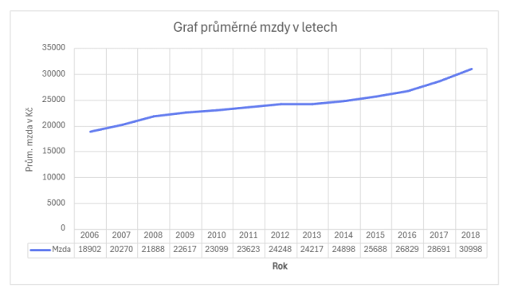

# Datová analýza

Vstupními daty jsou dvě tabulky, které je potřeba v DB vytvořit
dle SQL příkazů uvedených v následujících souborech: 
- t_michael_mahovsky_project_SQL_primary_final.sql
- t_michael_mahovsky_project_SQL_secondary_final.sql

První tabulka obsahuje data mezd (v Kč) a cen (v Kč) vybraných potravin pro roky 2006 až 2018. Průměrná hrubá mzda je uvedena jak pro jednotlivá odvětví, tak i pro celou republiku.
Druhá tabulka obsahuje výpis evropských zemí a hodnoty HDP (v miliardách USD), počet obyvatel a GINI index pro jednotlivé roky stejného období (2006 až 2018).

## Výzkumné otázky

1. Rostou v průběhu let mzdy ve všech odvětvích, 
nebo v některých klesají?
2. Kolik je možné si koupit litrů mléka a kilogramů chleba 
za první a poslední srovnatelné období v dostupných datech cen a mezd?
3. Která kategorie potravin zdražuje nejpomaleji 
(je u ní nejnižší percentuální meziroční nárůst)? 
4. Existuje rok, ve kterém byl meziroční nárůst cen potravin výrazně vyšší
než růst mezd (větší než 10 %)?
5. Má výška HDP vliv na změny ve mzdách a cenách potravin? 
Neboli, pokud HDP vzroste výrazněji v jednom roce, projeví se to na cenách 
potravin či mzdách ve stejném nebo následujícím roce výraznějším růstem?

#### Ad 1.
- soubor otazka1.sql

Odpověď: U některých odvětví (viz uvedený soubor) v některých letech došlo k poklesu průměrné hrubé mzdy, ale celkově od roku 2006 do roku 2018 došlo k růstu mezd ve všech odvětvích.

#### Ad 2.
- soubor otazka2.sql

Odpověď: V roce 2006 je možné si za průměrnou hrubou mzdu koupit 1 309 litrů mléka a 1 172 kg chleba. 
V roce 2018 1 563 litrů mléka a 1 278 kg chleba.   

#### Ad 3.
- soubor otazka3.sql

Odpověď: Nejpomaleji zdražila jablka, mezi lety 2006 a 2007 došlo u nich k poklesu ceny o 30,3 %.

#### Ad 4.
- soubor otazka4.sql

Odpověď: Meziroční nárůst cen potravin byl výrazně vyšší (přes 10 %) než růst mezd v těchto letech:
2007, 2008, 2010-2013, 2015, 2017 a 2018

#### Ad 5.
- soubor otazka5.sql

Odpověď: Za výraznější změnu HDP považuji meziroční změnu > 5 %, ta dle analýzy nastala v letech 2007, 2015 a 2017. Dále bylo zjištěno, že růst HDP má pozitivní vliv na růst průměrné mzdy. Nejvíce se růst HDP projevuje v následujícím kalendářním roce. Ve sledovaném období (2007-2008 a 2015-2018) vždy došlo k většímu zvýšení průměrné mzdy oproti jiným rokům.

U cen potravin tato závislost neexistuje. Ve stejném sledovaném období došlo z 26 druhů potravin u 5 až 10 potravin k meziročnímu poklesu ceny. Není zde tedy přímý vztah mezi vyšším růstem HDP a cenou potravin. Pravděpodobně půjde o dílčí menší vliv. Větší vliv na ceny potravin bude mít inflace, poměr nabídky a poptávky, úroda apod.
